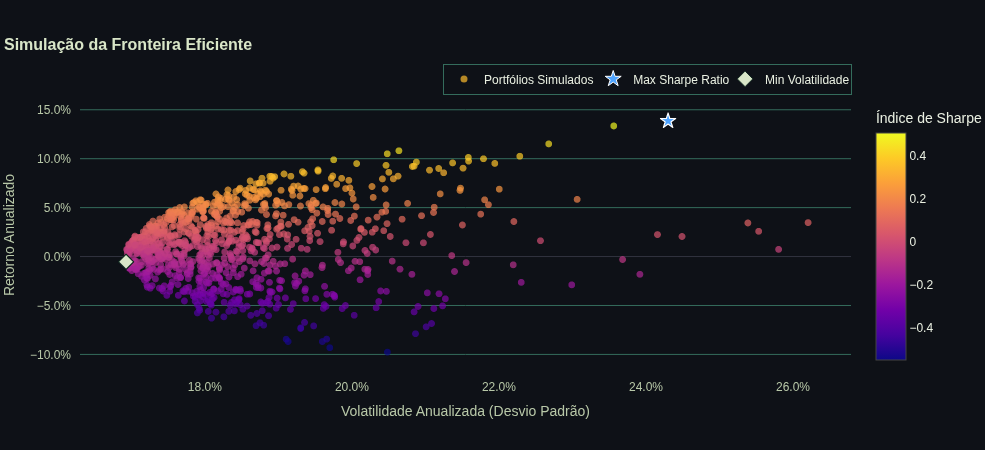

<p align="center">
  
  
</p>

# portfolio_optmization

A naive dashboard for running portfolio optimization with the Markowitz Framework."

<p align="center">
  
</p>

## Install Dependencies

```bash
poetry install

## Run the app

```bash
streamlit run app.py
```